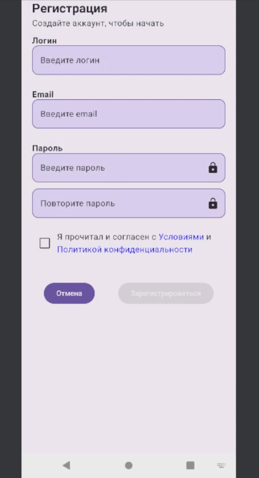
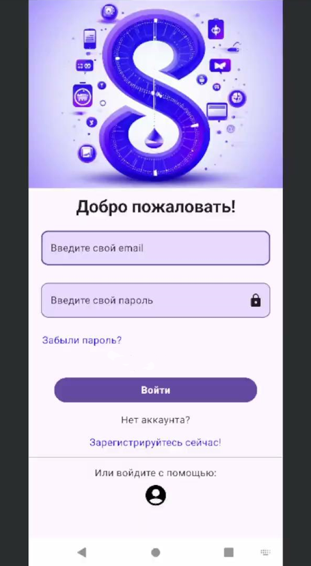
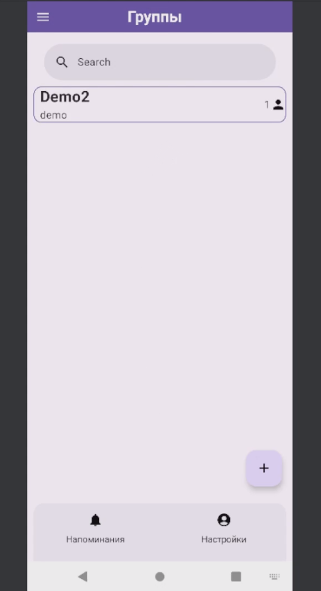

# Syncro
Курс по Android: мобильное приложение для группового трекинга задач.

Решение: MVVM + Compose UI + Retrofit + Room.
Демонстрирует навыки работы с сетью, архитектурой и UI.

## ✨ UI Overview

  
  

  
  

<video width="300" height="800" src="https://github.com/user-attachments/assets/f99000de-e9f8-45a1-b31e-0e09300b136f"></video>

## 🛠 Стек

- **UI**: Jetpack Compose, Navigation
- **Архитектура**: MVVM + Coroutines/Flow
- **Данные**: Retrofit 2 + Gson
- **DI**: Hilt

## 🚀 Установка
1. Клонируйте: `git clone https://github.com/Horsen121/Syncro`
2. Откройте в Android Studio
3. Синхронизируйте Gradle: `./gradlew build`
4. Запустите: `Run > Run 'app'`
